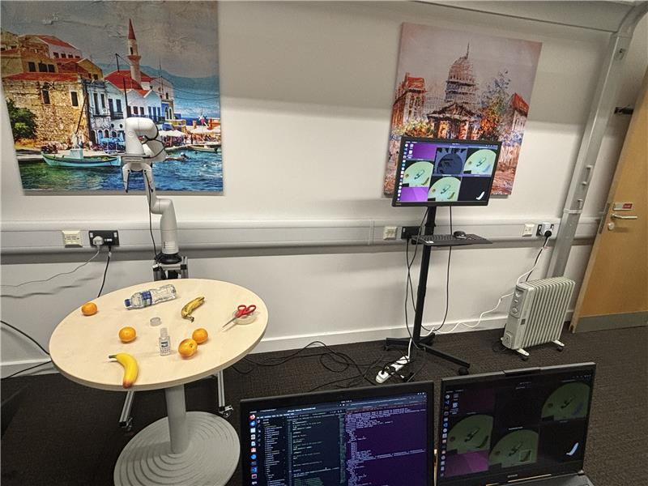

# EVF-SAM Kinonva Demo

This is a repository for manipulation part (kinova gen3 lite and realsense) of ward room demo.

---

## Procedure
### 1. Start moveit for kinova gen3 lite

    roslaunch kortex_driver kortex_driver.launch ip_address:=172.22.2.27 arm:=gen3_lite

### 2. Broadcast /camera_color (/camera_depth) to tf tree

    python3 camera_tf_broadcaster.py

### 3. Start EVF-SAM client (run EVF-SAM server on another computer), obtain the object position and broadcast /object to tf tree

    python3 evfsam_client_broadcast_object.py

### 4. Get transformation matrix (base to object) by listening to tf tree and start object grasping

    python3 grasp_object.py
